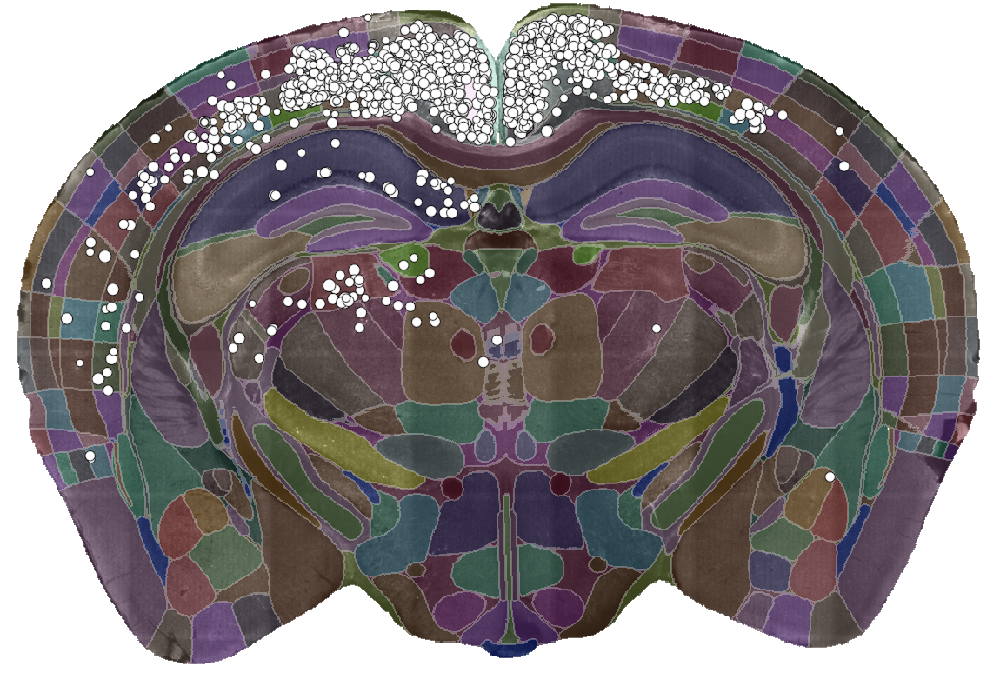

# Introduction

cellfinder is software from the [Margrie Lab](https://www.sainsburywellcome.org/web/groups/margrie-lab) at the [Sainsbury Wellcome Centre](https://www.sainsburywellcome.org/web/) for automated 3D cell detection and registration of whole-brain images \(e.g. serial two-photon or lightsheet imaging\).


The underlying cell detection algorithm is available for use \(e.g. for use with other types of data\) as a Python package \([cellfinder-core](../cellfinder-core/introduction.md)\) or as a [Napari plugin](../cellfinder-napari/introduction.md). 




cellfinder can:

* Detect labelled cells in 3D in whole-brain images \(many hundreds of GB\)
* Register the image to an atlas \(such as the [Allen Mouse Brain Atlas](https://atlas.brain-map.org/atlas?atlas=602630314)\)
* Segment the brain based on the reference atlas
* Calculate the volume of each brain area, and the number of labelled cells within it
* Transform everything into standard space for analysis and visualisation

**For more information see the** [**website**](https://cellfinder.info) **or** [**GitHub repository**](https://github.com/brainglobe/cellfinder)

## Installation

```text
pip install cellfinder
```


For detailed instructions see [Installation](installation/)


## Usage

For information on how to use cellfinder, see the [User guide](user-guide/), or for a step-by step walkthrough, see the [Tutorial](tutorial/).

