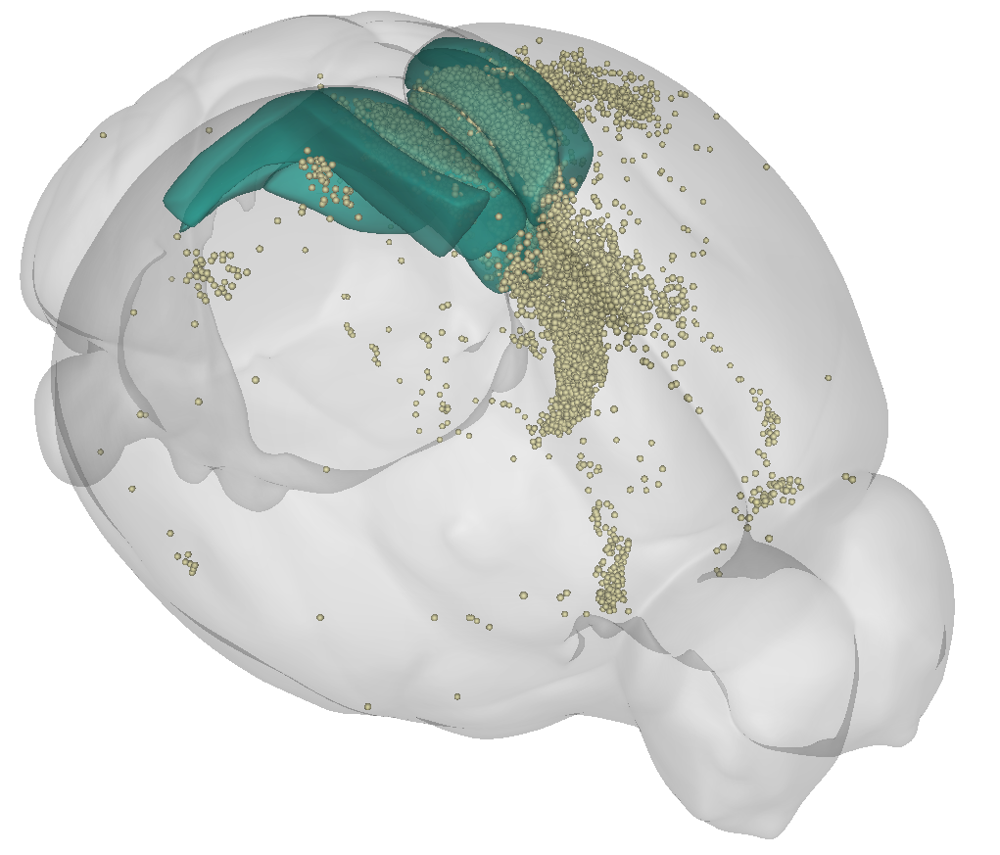

# Visualising your data in brainrender



To generate 3D figures of your data in atlas space, you can use [brainrender](https://github.com/BrancoLab/brainrender). cellfinder automatically exports a file in a brainrender compatible format, which can be found at `test_brain/output/points/points.npy`.&#x20;

Once you've [installed brainrender](https://docs.brainrender.info/installation/installation), you can try something like this:

```python
from brainrender.scene import Scene
from brainrender.actors import Points

cells_path = "test_brain/output/points/points.npy"

# intialise brainrender scene
scene = Scene()

# create points actor
cells = Points(cells_path, radius=45, colors="palegoldenrod", alpha=0.8)

# visualise injection site (retrosplenial cortex)
scene.add_brain_regions(["RSPd"], colors="mediumseagreen", alpha=0.6)
scene.add_brain_regions(["RSPv"], colors="purple", alpha=0.6)
scene.add_brain_regions(["RSPagl"], colors="mediumseagreen", alpha=0.6)

# Add cells
scene.add(cells)

scene.render()
```

Alternatively, you can use the [brainrender GUI](broken-reference), and use the `Add cells` button to load the `points.npy` file. You can use `Show structures tree` to visualise brain areas.


As the `points.h5`file contains the detected cells in atlas space, you can load cells from multiple brains (e.g. in a different colour).

