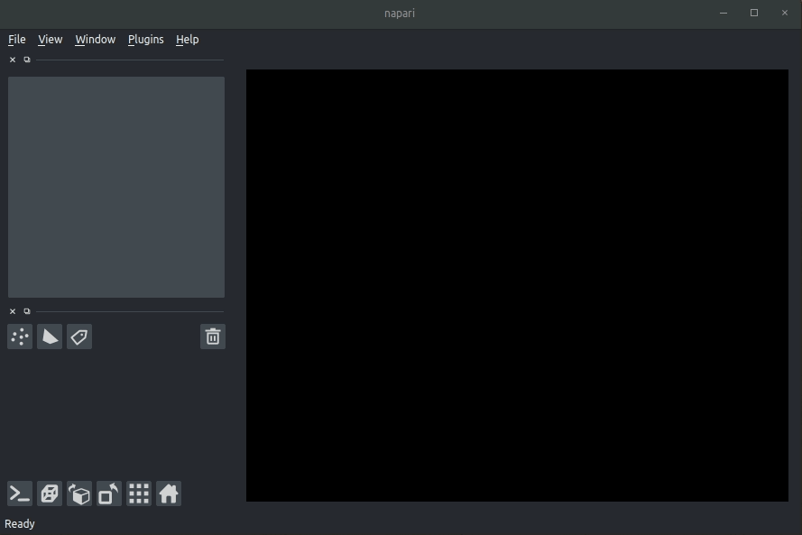

# Visualisation

## Usage

### Getting started

To view your data, firstly open napari. The easiest way to do this is open a terminal \(making sure your cellfinder conda environment is activated\), then just type `napari`. A napari window should open.

### Visualising your raw data

Assuming that your raw data is stored as `.tiff` files, drag these into napari \(onto the main window in the middle\). This should be whatever you passed to cellfinder originally, i.e. a single multipage tiff, or a directory of 2D tiffs. You can load as many channels as you like \(e.g. the signal and the background channel\).

### Visualising your results

You can then drag and drop the cellfinder output directory \(the one you specified with the `-o` flag\) into the napari window. The plugin will then load your detected cells \(in yellow\) and the rejected cell candidates \(in blue\). If you carried out registration, then these results will be overlaid \(similarly to the [brainreg](../../brainreg/visualisation.md) plugin, but transformed to the coordinate space of your raw data\).

